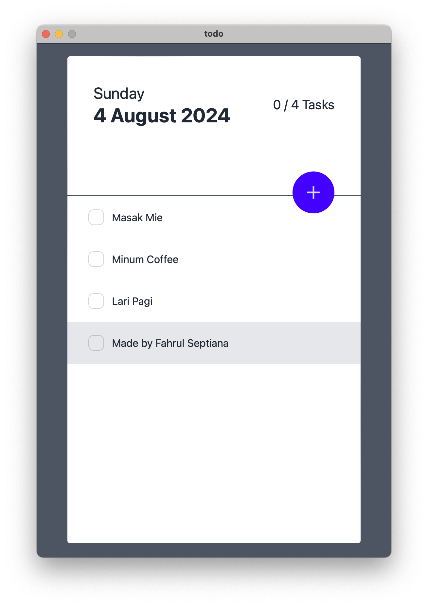

# Desktop TO-DO App

## About

This is my desktop To-Do app(s) built using [Wails](https:///wails.app/).

## Dependencies

### Frontend
- [ReactJS](https://react.dev/)
- [TailwindCSS](https://tailwindcss.com/)
- [DaisyUI](https://daisyui.com/)

### Backend
- [Go (Golang) v1.22.5](https://go.dev/)
- [BBolt](https://github.com/etcd-io/bbolt)
- [mapstructure](https://github.com/go-viper/mapstructure)
- [ulid](https://github.com/oklog/ulid)

## What to finish

- [x] Scaffold
- [x] Insert Todo
- [x] Update Todo
- [ ] Delete Todo

## Prerequisite

- NodeJS v20.16.0
- Go v1.22.5

## Live Development

To run in live development mode, run `wails dev` in the project directory. This will run a Vite development
server that will provide very fast hot reload of your frontend changes. If you want to develop in a browser
and have access to your Go methods, there is also a dev server that runs on http://localhost:34115. Connect
to this in your browser, and you can call your Go code from devtools.

## Building

To build a redistributable, production mode package, use `wails build`.
